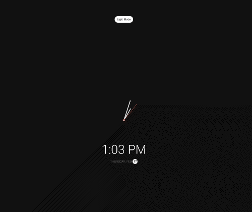

# Theme Clock

## Description
Several things going on this widget:
- Takes in the window specified theme and or the override of the button to toggle dark mode
- Takes in the time and renders both an analog clock and a digital clock
 
 

### (Screen Capture)
