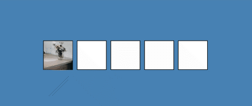

# Drag and Drop

## Description
This app uses the `draggable` property and several event listeners to allow the user to drag the image box to a new square/zone.
 
 

### (Screen Capture)

*(Screencap doesn't show the image hovering, but it does for the user)*